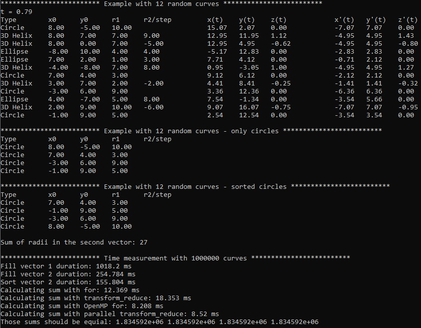

# CAD-Exchanger-test
A test case with a simple class structure and a few tasks to demonstrate basic STL knowledge

* 3DCurveDLL is a folder with the .dll Visual Studio project
* "CAD Exchanger test with dll" is a folder with the main Visual Studio project that uses the .dll
* "CAD Exchanger test with dll.exe" with 3DCurveDLL.dll are the resuls of those projects that work together
* Parametrized3DCurveDLL.h with Parametrized3DCurveDLL.cpp are the main source code files of the .dll
* "CAD Exchanger test with dll.cpp" is the main source code file of the .exe

This compiles with MS Visual Studio 22 with C++ v20 and OpenMP support options.

"CAD Exchanger test with dll.exe" performs a number of tasks: 
* design classes for a few types of 3D parametrized curves in a .dll library
* populate a list of them
* populate another one from only circles of the first
* sort the second one and compute the sum of radii
* compute that sum with OpenMP

And shows something like this:

